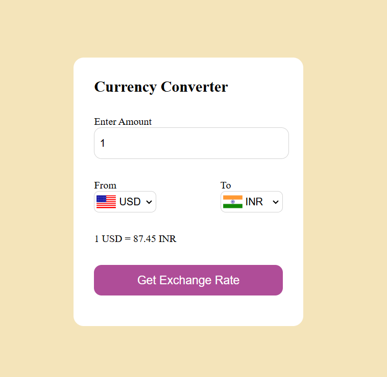

# 💰 Currency Converter

A simple web-based **Currency Converter** that allows users to convert between different currencies in real time.

## 🌟 Features
- Convert between multiple currencies  
- Uses real-time exchange rates 
- User-friendly interface  
- Lightweight and fast  
- Works on all modern browsers  

## 🛠 Technologies Used
- **HTML** – Structure of the webpage  
- **CSS** – Styling and layout  
- **JavaScript** – Logic for currency conversion  
- **API** – For real-time exchange rates 

## 🎮 How to Use
1.Select the base currency (e.g., USD).
2.Choose the target currency (e.g., INR).
3.Enter the amount and click Convert.
4.The converted value will be displayed instantly.

## 📷 Screenshot
Here’s a preview of the Currency Converter:

